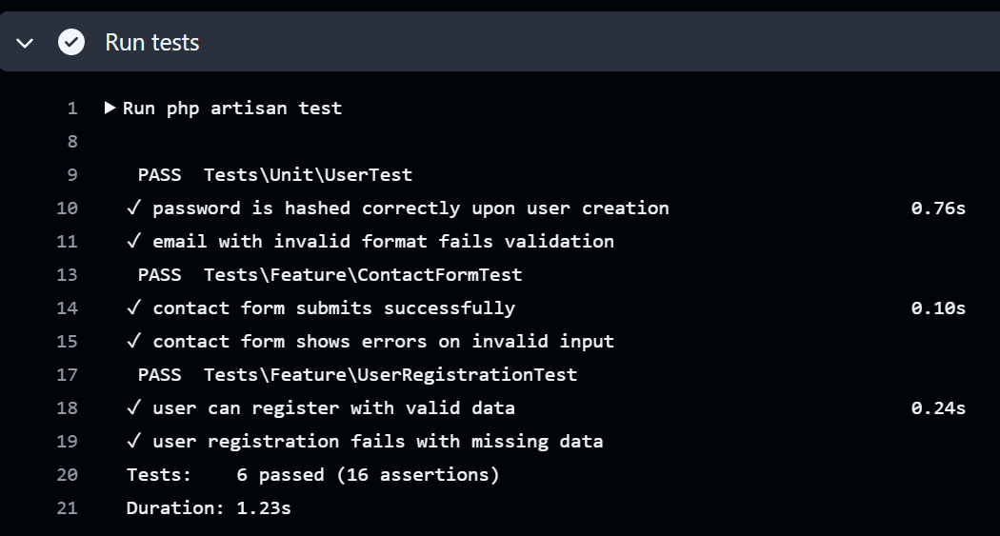
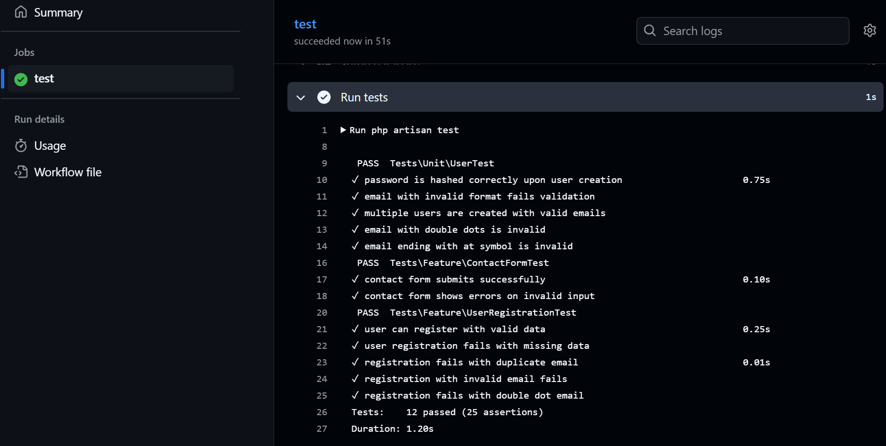

# Script-Kiddie Laravel Project – Test Plan & Evaluation

## Contents

* [Test Plan](#test-plan)

  * [User Stories](#user-stories)
  * [Acceptance Criteria](#acceptance-criteria)
  * [Why Some Parts Are or Aren't Tested](#why-some-parts-are-or-arent-tested)
  * [Link to the V-Model](#link-to-the-v-model)
  * [System Tests](#system-tests)
  * [Unit Tests](#unit-tests)
* [Test Results Screenshot](#test-results-screenshot)
* [Evaluation](#evaluation)

  * [Detectable Errors](#detectable-errors)
  * [Undetectable Errors](#undetectable-errors)
  * [Test Coverage Conclusion](#test-coverage-conclusion)
  * [Test Automation and Effectiveness](#test-automation-and-effectiveness)
  * [Critical Reflection and Improvement Proposal](#critical-reflection-and-improvement-proposal)

---

## Test Plan

### User Stories

1. **As a visitor**, I want to send a message using the contact form so that I can ask questions or provide feedback.
2. **As a new user**, I want to register securely so I can log in and access the application.

### Acceptance Criteria

* Contact Form:

  * A message must have a valid name, email, and a non-empty message.
  * Invalid formats (like `email@`) or missing fields should show appropriate errors.

* Registration:

  * A user must provide a unique email, a name, and a password with at least 8 characters.
  * Repeated emails or weak passwords must be rejected.

---

### Why Some Parts Are or Aren’t Tested

* ✅ Core logic (validation, user creation, form submission) **is tested**.
* ❌ **Email sending** is not tested due to lack of mocking in current setup.
* ❌ **UI/UX rendering** and **CSS behavior** are not automated; these require manual or visual testing.
* ❌ **Performance** is not tested; would require stress/load tools (e.g., JMeter).
* These limitations are by design to focus on Laravel’s backend behavior in this phase.

---

### Link to the V-Model

| V-Model Phase       | Test Level  | User Story        | Test Focus                                    |
| ------------------- | ----------- | ----------------- | --------------------------------------------- |
| **Requirements**    | System Test | Contact Form      | End-to-end flow, validation + DB persistence. |
| **Requirements**    | System Test | User Registration | Full registration path, happy + edge cases.   |
| **Detailed Design** | Unit Test   | User Registration | User object creation, password hashing.       |
| **Detailed Design** | Unit Test   | Email Validation  | Email format rejection at low level.          |

---

### System Tests (using AAA)

#### `user_can_register_with_valid_data`

```php
public function user_can_register_with_valid_data()
{
    // Arrange
    $userData = User::factory()->make()->toArray();
    $userData['password'] = 'password123';
    $userData['password_confirmation'] = 'password123';

    // Act
    $response = $this->post('/register', $userData);

    // Assert
    $response->assertRedirect('/dashboard');
    $this->assertDatabaseHas('users', ['email' => $userData['email']]);
}
```

#### `contact_form_submits_successfully`

```php
public function contact_form_submits_successfully()
{
    // Arrange
    $formData = [
        'name' => 'Jane Doe',
        'email' => 'jane@example.com',
        'message' => 'This is a test message.',
    ];

    // Act
    $response = $this->post('/contact', $formData);

    // Assert
    $response->assertStatus(302);
    $response->assertSessionHas('success');
}

```

#### `registration_fails_with_invalid_email_format`

```php
public function registration_fails_with_invalid_email_format()
{
    // Arrange
    $userData = [
        'name' => 'Invalid Email User',
        'email' => 'invalid..email@',
        'password' => 'password123',
        'password_confirmation' => 'password123',
    ];

    // Act
    $response = $this->post('/register', $userData);

    // Assert
    $response->assertSessionHasErrors(['email']);
}


```

---

### Unit Tests (using AAA)

#### `multiple_users_are_created_with_unique_emails`

```php
public function multiple_users_are_created_with_unique_emails()
{
    // Arrange
    $users = User::factory()->count(3)->make();

    // Act
    $emails = $users->pluck('email')->toArray();

    // Assert
    $this->assertCount(3, array_unique($emails));
}

```

#### `password_is_hashed_correctly`

```php
public function password_is_hashed_correctly()
{
    // Arrange
    $password = 'SuperSecure123!';
    $user = User::factory()->make(['password' => bcrypt($password)]);

    // Assert
    $this->assertNotEquals($password, $user->password);
    $this->assertTrue(Hash::check($password, $user->password));
}

```
#### `email_with_invalid_format_is_rejected`

```php
public function email_with_invalid_format_is_rejected()
{
    // Arrange
    $invalidEmail = 'wrong..email@';

    // Act
    $isValid = filter_var($invalidEmail, FILTER_VALIDATE_EMAIL);

    // Assert
    $this->assertFalse($isValid);
}


```
---

## Test Results Screenshot




---

## Evaluation
Writing and running tests went according to plan, and all major user stories are covered by tests. Tests cover a range of inputs, including valid and invalid cases. Unit tests focus on low-level logic, while system tests simulate real user flows.

### Detectable Errors

* Validation errors like:
    * Email format issues
    * Empty fields
    * Password mismatch
* Registration success and DB creation
* Contact form success and session feedback

### Undetectable Errors

* UI issues (e.g., elements not visible or clickable)
* Network/mail integration (mail sending was not mocked)
* Security issues (XSS, CSRF) not tested explicitly

### Test Coverage Conclusion

* Tests **cover all user stories** defined in the planning stage.
* Edge cases such as `invalid..email@` and empty message fields are tested.
* Unit tests are isolated and don't rely on database or HTTP context.
* However, some parts like UI rendering and real mail delivery require further tools (Laravel Dusk, Mail fake).

---

### Test Automation and Effectiveness

* All tests run via `php artisan test`
* GitHub Actions CI is configured to run tests on push — **but hasn’t been verified on actual push yet**
* Tests run fast (under 1s) and reliably
* Laravel Factory is used to ensure realistic and clean data in both system and unit tests

---

### Critical Reflection and Improvement Proposal

The testing process was smooth, and all intended test cases were implemented successfully. The combination of unit and system tests provides solid backend confidence.

**Improvements:**

1. Add integration tests using `Mail::fake()` to test mail-sending without requiring a real SMTP server.
2. Integrate UI testing with Laravel Dusk for full end-to-end testing of frontend behavior.
3. Verify CI by performing a real GitHub push with failing and passing tests.
4. Consider adding performance/stress testing tools if scaling becomes a concern.
