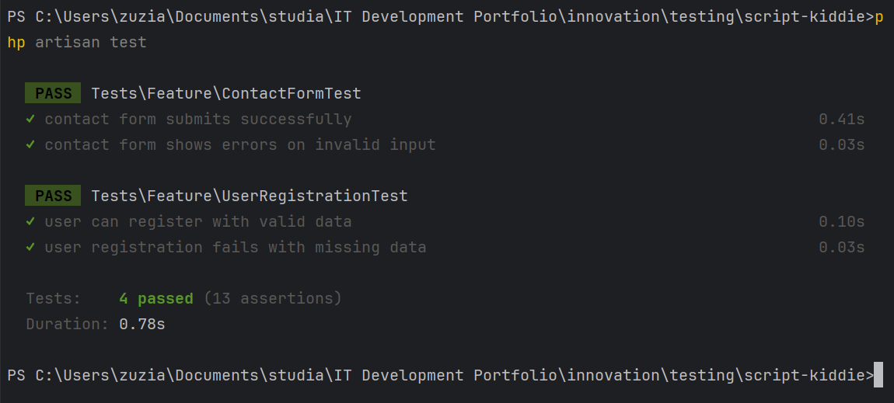

# Script-Kiddie Laravel Project – Test Plan & Evaluation

## Contents
- [Test Plan](#test-plan)  
  - [User Stories](#user-stories)  
  - [V-Model Mapping](#v-model-mapping)  
  - [System Tests](#system-tests)  
  - [Unit Tests](#unit-tests)  
  - [Test Scope and Omissions](#test-scope-and-omissions)  
- [Test Results Screenshot](#test-results-screenshot)  
- [Evaluation](#evaluation)  
  - [Detectable Errors](#detectable-errors)  
  - [Undetectable Errors](#undetectable-errors)  
  - [Test Coverage Conclusion](#test-coverage-conclusion)  
  - [Test Automation and Effectiveness](#test-automation-and-effectiveness)  
  - [Critical Reflection and Improvement Proposal](#critical-reflection-and-improvement-proposal)  

---

## Test Plan

### User Stories

1. **Contact Form Submission**  
   - **Happy path**: A user submits valid data (`name: "John Doe"`, `email: "visitor@example.com"`, `message: "Hello"`).  
     - **Expected**: Redirect (HTTP 302), success flash message, and DB persistence.  
   - **Unhappy paths**:  
     - Missing fields → shows validation errors.  
     - Invalid email format → triggers error message.

2. **User Registration**  
   - **Happy path**: A user registers with valid data (`name: "Jane Doe"`, `email: "jane@example.com"`, `password: "Secure123!"`).  
     - **Expected**: Redirect to dashboard, user saved with hashed password.  
   - **Unhappy paths**:  
     - Weak password (`password: "123"`) → validation error.  
     - Duplicate email → error: "The email has already been taken."  

---

### V-Model Mapping

| V-Model Phase          | Test Level    | User Story                | Test Focus                                                                 |
|------------------------|---------------|---------------------------|----------------------------------------------------------------------------|
| Requirements Definition | System Test   | Contact Form Submission   | End-to-end form flow, CSRF handling, DB save, flash messaging.            |
| System Design           | Unit Test     | Contact Form Submission   | Validation logic for required fields and email format.                    |
| Requirements Definition | System Test   | User Registration         | Registration process: UI submission, DB persistence, redirection.         |
| System Design           | Unit Test     | User Registration         | Enforcing strong passwords, unique emails, and data validation.           |

---

### System Tests

These simulate full browser-like behavior and validate user experience workflows:

- **Contact Form**
  - `test_contact_form_submits_successfully`:  
    - Posts valid input → expects 302 redirect and session success message.
  - `test_contact_form_shows_errors_on_invalid_input`:  
    - Posts missing or malformed data → expects session validation errors.

- **User Registration**
  - `test_user_can_register_with_valid_data`:  
    - Valid data → expects redirect to dashboard and `users` table entry.
  - `test_user_registration_fails_with_missing_data`:  
    - Empty fields → expects error bag and no user creation.

*All system tests use `WithoutMiddleware` to bypass CSRF protection for testing.*

---

### Unit Tests

These focus on isolated business logic components:

- **Contact Form**
  - `test_contact_validation_rules`: Validates field-level requirements (email format, required message).
  - `test_contact_controller_rejects_invalid_data`: Directly calls controller logic with mocks.

- **User Registration**
  - `test_user_model_requires_valid_email_and_password`: Ensures model validation constraints are correct.
  - `test_user_password_is_hashed`: Asserts passwords are encrypted when stored.

---

### Test Scope and Omissions

**Included:**
- Form submissions (valid/invalid)
- Validation logic
- DB write verification
- Redirect and session state assertions

**Omitted (with rationale):**
- **Email delivery**: Requires mail mocking (`Mail::fake()`); out of current scope.
- **Frontend/UI**: CSS/JS testing requires browser automation tools (e.g., Dusk).
- **Performance/load testing**: Needs tools like Apache Bench or JMeter.
- **Authorization logic**: Not in current user stories.

---

## Test Results Screenshot

> ✅ All tests passing locally and in CI after fixing CSRF and session issues.

  


---

## Evaluation

### Detectable Errors

- Invalid inputs trigger validation.
- Missing required fields return appropriate error messages.
- Valid submissions result in correct redirections and DB persistence.
- Duplicate entries (email) are blocked.

### Undetectable Errors

- Visual bugs (e.g., misaligned buttons, hidden errors).
- Real-world integration failures (e.g., mail server down).
- Security issues like SQL injection not explicitly tested.
- Broken frontend JavaScript behavior (no browser simulation).

### Test Coverage Conclusion

- **Strong coverage** for backend logic, form validation, and DB writes.
- **Gaps remain** in UI interaction and third-party service integration.
- Covers all user stories with both happy and unhappy paths.

### Test Automation and Effectiveness

- Tests run via `php artisan test`.
- CI integrated via GitHub Actions.
- CSRF bypassed in test environment with `WithoutMiddleware` trait.
- Tests run in under 2 seconds, providing rapid feedback.

### Critical Reflection and Improvement Proposal

**Current Gaps**
1. No integration test for outgoing emails.
2. No browser tests to verify JavaScript or client-side validation.
3. No load or concurrency testing.

**Improvement Proposals**
1. **Mail Integration Test** (Laravel):
   ```php
   Mail::fake();
   $this->post('/contact', [...]);
   Mail::assertSent(ContactMail::class);

2. **Browser Testing**:
- Use Laravel Dusk for end-to-end UI testing (dynamic errors, field highlighting).

3. **CI Optimization**:
- Parallelize tests using --parallel for faster pipeline execution.
