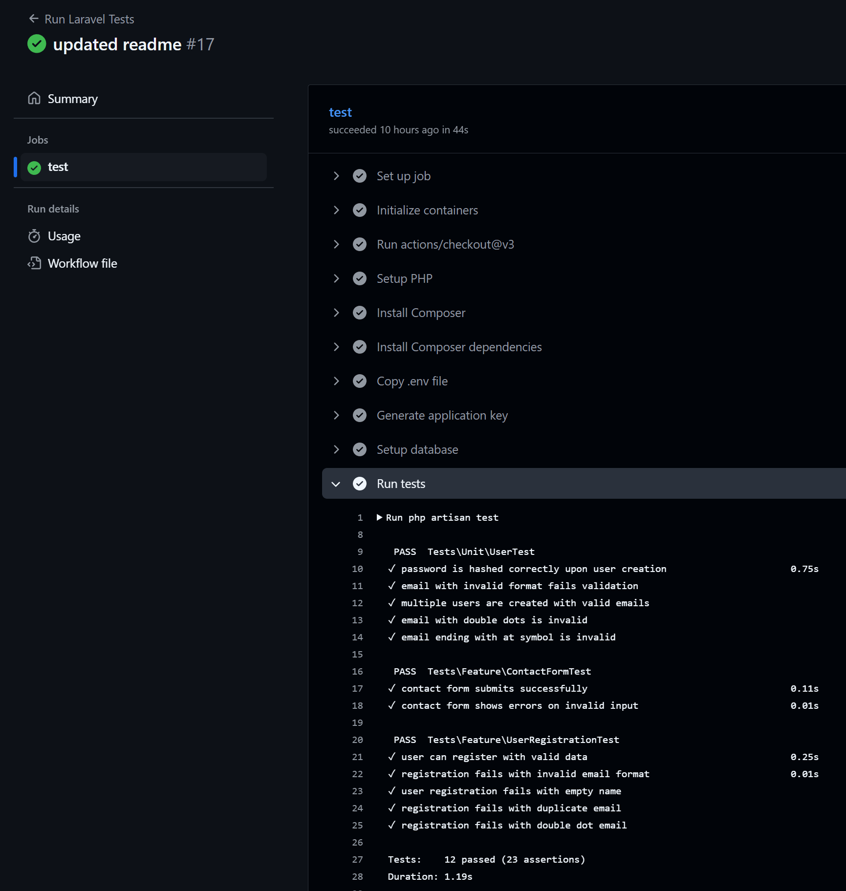

# Script-Kiddie Laravel Project – Test Plan & Evaluation

## Contents

* [Test Plan](#test-plan)

  * [User Stories](#user-stories)
  * [Acceptance Criteria](#acceptance-criteria)
  * [Why Some Parts Are or Aren't Tested](#why-some-parts-are-or-arent-tested)
  * [Link to the V-Model](#link-to-the-v-model)
* [Test Plan Implementation](#test-plan-implementation)
  * [System Tests](#system-tests)
  * [Unit Tests](#unit-tests)
* [Test Results Screenshot](#test-results-screenshot)
* [Evaluation](#evaluation)

  * [Detectable Errors](#detectable-errors)
  * [Undetectable Errors](#undetectable-errors)
  * [Test Coverage Conclusion](#test-coverage-conclusion)
  * [Test Automation and Effectiveness](#test-automation-and-effectiveness)
  * [Critical Reflection and Improvement Proposal](#critical-reflection-and-improvement-proposal)

---

## Test Plan

### User Stories

1. **As a visitor**, I want to send a message using the contact form so that I can ask questions or provide feedback.

   - **Happy Path**: Visitor submits form with valid name, email, and message.
   - **Unhappy Path**: Visitor submits form with missing fields or invalid email.
   - **Scenario**: Contact form submission.

2. **As a new user**, I want to register securely so I can log in and access the application.

   - **Happy Path**: User submits valid name, unique email, and strong password.
   - **Unhappy Path**: User submits empty name, invalid email format, double-dot email, duplicate email, or password mismatch.
   - **Scenario**: Registration and validation.

3. **As a developer**, I want to ensure that validation and hashing logic works correctly, so user data remains secure and formatted.

   - **Happy Path**: Password is hashed, email passes validation.
   - **Unhappy Path**: Email fails due to invalid format (double dots, ending with `@`, etc.).
   - **Scenario**: Unit tests for validation logic.

### Acceptance Criteria

* Contact Form:

  * A message must have a valid name, email, and a non-empty message.
  * Invalid formats (like `email@`) or missing fields should show appropriate errors.

* Registration:

  * A user must provide a unique email, a name, and a password with at least 8 characters.
  * Repeated emails or weak passwords must be rejected.

* Validation Logic:

  * Email must be RFC-compliant.
  * Passwords must be hashed before storing.
---

### Why Some Parts Are or Aren’t Tested

* ✅ Core logic (validation, user creation, form submission) **is tested**.
* ❌ **Email sending** is not tested due to lack of mocking in current setup.
* ❌ **UI/UX rendering** and **CSS behavior** are not automated; these require manual or visual testing.
* ❌ **Performance** is not tested; would require stress/load tools (e.g., JMeter).
* These limitations are by design to focus on Laravel’s backend behavior in this phase.

---

### Link to the V-Model

| V-Model Phase       | Test Level  | User Story              | Scenario Description              | Test Description                                   |
| ------------------- | ----------- | ----------------------- | --------------------------------- | -------------------------------------------------- |
| **Specification**   | System Test | Visitor submits contact | Valid/invalid name/email/message  | Form submission, error handling, session feedback  |
| **Specification**   | System Test | New user registers      | Valid/invalid email/name/password | User creation, DB persistence, redirection         |
| **Detailed Design** | Unit Test   | User creation factory   | Multiple users with unique emails | Tests email uniqueness, password hashing           |
| **Detailed Design** | Unit Test   | Validation logic        | Invalid email, empty fields       | Tests Laravel validator logic for input edge cases |
| **Detailed Design** | Unit Test   |Password hashing         | Password security                 | Ensure plain-text password is not stored           |

---
## Implementation

### System Tests (using AAA)

#### `ContactFormTest.php`

##### `contact_form_submits_successfully`

```php
    #[Test]
    public function contact_form_submits_successfully()
    {
        // Arrange
        $formData = [
            'name' => 'John',
            'email' => 'john@example.com',
            'message' => 'Hi, this is a test.',
        ];

        // Act
        $response = $this->post('/contact', $formData);

        // Assert
        $response->assertStatus(302);
        $response->assertSessionHas('success');
}
```

##### `contact_form_shows_errors_on_invalid_input`

```php
    #[Test]
    public function contact_form_shows_errors_on_invalid_input()
    {
        $response = $this->post('/contact', [
            'name' => '',
            'email' => 'not-an-email',
            'message' => '',
        ]);

        $response->assertSessionHasErrors(['name', 'email', 'message']);
    }
```

#### `UserRegistrationTest.php`

##### `user_can_register_with_valid_data`

```php
    #[Test]
    public function user_can_register_with_valid_data()
    {
        // Arrange
        $newUserData = User::factory()->make()->toArray();
        $newUserData['password'] = 'password123';
        $newUserData['password_confirmation'] = 'password123';

        // Act
        $response = $this->post('/register', $newUserData);

        // Assert
        $response->assertRedirect('/dashboard');
        $this->assertDatabaseHas('users', ['email' => $newUserData['email']]);
    }
```

##### `registration_fails_with_invalid_email_format`

```php
    #[Test]
    public function registration_fails_with_invalid_email_format()
    {
        $userData = User::factory()->make([
            'email' => 'invalid..email@'
        ])->toArray();
        $userData['password'] = 'password123';
        $userData['password_confirmation'] = 'password123';

        $response = $this->post('/register', $userData);

        $response->assertSessionHasErrors(['email']);
    }
```

##### `user_registration_fails_with_empty_name`

```php
    #[Test]
    public function user_registration_fails_with_empty_name()
    {
        $userData = User::factory()->make(['name' => ''])->toArray();
        $userData['password'] = 'password123';
        $userData['password_confirmation'] = 'password123';

        $response = $this->post('/register', $userData);

        $response->assertSessionHasErrors(['name']);
    }
```

##### `registration_fails_with_duplicate_email`

```php
    #[Test]
    public function registration_fails_with_duplicate_email()
    {
        // Arrange
        User::factory()->create(['email' => 'dupe@example.com']);
        $userData = [
            'name' => 'Another User',
            'email' => 'dupe@example.com',
            'password' => 'anotherpassword',
            'password_confirmation' => 'anotherpassword',
        ];

        // Act
        $response = $this->post('/register', $userData);

        // Assert
        $response->assertSessionHasErrors('email');
    }
```

##### `registration_fails_with_double_dot_email`

```php
    #[Test]
    public function registration_fails_with_double_dot_email()
    {
        // Arrange
        $userData = [
            'name' => 'Edge Case User',
            'email' => 'user..name@example.com',
            'password' => 'password123',
            'password_confirmation' => 'password123',
        ];

        // Act
        $response = $this->post('/register', $userData);

        // Assert
        $response->assertSessionHasErrors(['email']);
    }
```

### Unit Tests (using AAA)
#### `UserTest.php`

##### `password_is_hashed_correctly_upon_user_creation`

```php
    #[Test]
    public function password_is_hashed_correctly_upon_user_creation()
    {
        // Arrange
        $password = 'SecurePassword123!';
        $user = User::factory()->make([
            'password' => bcrypt($password)
        ]);

        // Assert
        $this->assertNotEquals($password, $user->password);
        $this->assertTrue(Hash::check($password, $user->password));
    }
```

##### `email_with_invalid_format_fails_validation`

```php
    #[Test]
    public function email_with_invalid_format_fails_validation(): void
    {
        // Arrange
        $invalidEmail = 'invalid..@email';

        // Act
        $isValid = filter_var($invalidEmail, FILTER_VALIDATE_EMAIL);

        // Assert
        $this->assertFalse($isValid);
    }
```

##### `multiple_users_are_created_with_valid_emails`

```php
    #[Test]
    public function multiple_users_are_created_with_valid_emails()
    {
        // Arrange
        $users = User::factory()->count(3)->make();

        // Act & Assert
        $emails = $users->pluck('email')->toArray();
        $this->assertCount(3, array_unique($emails));
    }
```

##### `email_with_double_dots_is_invalid`

```php
    #[Test]
    public function email_with_double_dots_is_invalid()
    {
        // Arrange
        $invalidEmail = 'test..email@example.com';

        // Act
        $isValid = filter_var($invalidEmail, FILTER_VALIDATE_EMAIL);

        // Assert
        $this->assertFalse($isValid);
    }
```

##### `email_ending_with_at_symbol_is_invalid`

```php
    #[Test]
    public function email_ending_with_at_symbol_is_invalid()
    {
        // Arrange
        $invalidEmail = 'test@';

        // Act
        $isValid = filter_var($invalidEmail, FILTER_VALIDATE_EMAIL);

        // Assert
        $this->assertFalse($isValid);
    }
```
---

## Test Results Screenshot




---

## Evaluation
Writing and running tests went according to plan, and all major user stories are covered by tests. Tests cover a range of inputs, including valid and invalid cases. Unit tests focus on low-level logic, while system tests simulate real user flows.

### Detectable Errors

* Validation errors like:
    * Email format issues
    * Empty fields
    * Password mismatch
* Registration success and DB creation
* Contact form success and session feedback

### Undetectable Errors

* UI issues (e.g., elements not visible or clickable)
* Network/mail integration (mail sending was not mocked)
* Security issues (XSS, CSRF) not tested explicitly

### Test Coverage Conclusion

* Tests **cover all user stories** defined in the planning stage.
* Edge cases such as `invalid..email@` and empty message fields are tested.
* Unit tests are isolated and don't rely on database or HTTP context.
* However, some parts like UI rendering and real mail delivery require further tools (Laravel Dusk, Mail fake).

---

### Test Automation and Effectiveness

* All tests run via `php artisan test`
* GitHub Actions CI is configured to run tests on push — **but hasn’t been verified on actual push yet**
* Tests run fast (under 1s) and reliably
* Laravel Factory is used to ensure realistic and clean data in both system and unit tests

---

### Critical Reflection and Improvement Proposal

The testing process was smooth, and all intended test cases were implemented successfully. The combination of unit and system tests provides solid backend confidence.

**Improvements:**

1. Add integration tests using `Mail::fake()` to test mail-sending without requiring a real SMTP server.
2. Integrate UI testing with Laravel Dusk for full end-to-end testing of frontend behavior.
3. Verify CI by performing a real GitHub push with failing and passing tests.
4. Consider adding performance/stress testing tools if scaling becomes a concern.
